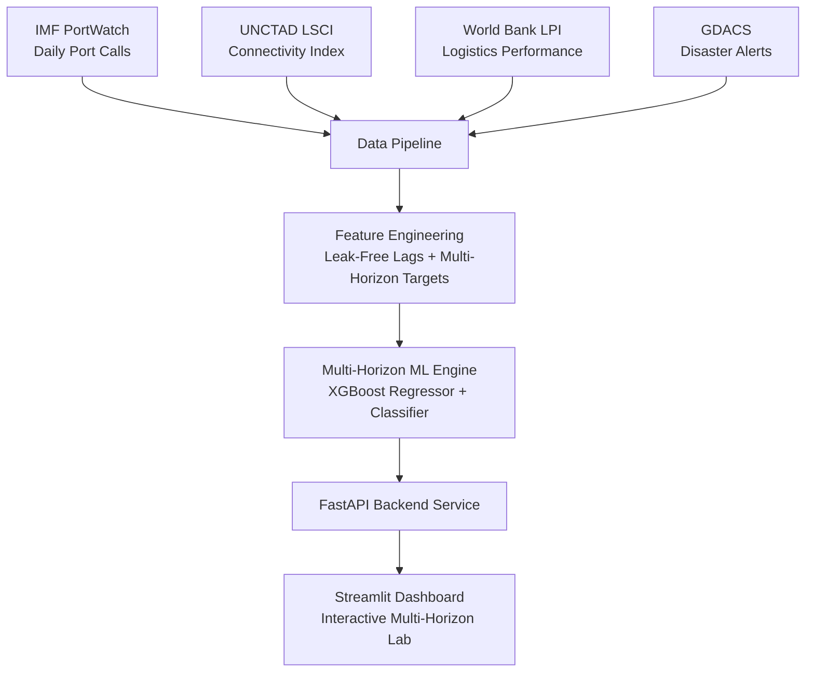

# PortWatch AI 🚢

**Global Supply Chain Disruption Intelligence & Port Congestion Forecasting Platform**

> Satellite-derived port congestion forecasting and trade flow risk monitoring across multi-day horizons.

[](#)
[](LICENSE)
[](https://github.com/astral-sh/ruff)
[](#)

---

## 🌐 Project Overview

**PortWatch AI** fuses satellite-derived port activity (IMF PortWatch), liner shipping connectivity (UNCTAD LSCI), logistics performance indicators (World Bank LPI), and real-time disaster alerts (GDACS) to forecast global port congestion levels and identify supply-chain disruption risks up to 14 days ahead.

The platform provides a hardened **FastAPI backend** and an interactive **Streamlit dashboard** equipped with SHAP explainability to help logistics operators, maritime analysts, and policy researchers anticipate port delays.

---

## 🏗️ System Architecture



---

## 🤖 Forecasting & ML Methodology

### 1. Multi-Horizon Forecasting Targets
Unlike standard regression pipelines that predict static values at time $t$, PortWatch AI trains explicit horizon-conditioned target models ($t+1$, $t+7$, and $t+14$ days ahead):
- **Regression Target ($y_{t+h}$)**: Lead normalized port congestion index ($z$-score of 7-day moving average calls against historical baselines).
- **Classification Target ($C_{t+h}$)**: 4-class risk level (`LOW`, `NORMAL`, `HIGH`, `CRITICAL`).

### 2. Leakage Prevention & Feature Engineering
- Features at time $t$ rely strictly on historical observations available at or before $t$ (e.g. `port_calls_lag_1d`, `lag_2d`, `lag_7d`, `global_chokepoint_transit`, `active_disasters_7d`).
- `historical_mean` and `historical_std` statistics per port are computed strictly on training partitions to prevent future target leakage.

### 3. Temporal Validation Strategy
Data is partitioned strictly by time sequence (no random train/test splits):
- **Train Period**: $\le$ `2023-05-31`
- **Validation Period**: `2023-06-01` to `2023-12-31`
- **Untouched Test Period**: $\ge$ `2024-01-01`

---

## 📈 Empirical Evaluation & Baseline Comparison

Every machine learning model is benchmarked against standard time-series baselines (**Naive Persistence** and **Rolling Mean**) on the untouched test partition.

| Model | Horizon | MAE | RMSE | $R^2$ | Accuracy | Macro F1 | Baseline Imprv. |
|---|---|---|---|---|---|---|---|
| Naive Persistence | 1-Day | 0.0795 | 0.1035 | 0.0000 | N/A | N/A | 0.0% |
| **XGBoost (Primary)** | **1-Day** | **0.5659** | **0.6639** | **0.1635** | **47.4%** | **0.3571** | **+16.4% ($R^2$)** |
| Naive Persistence | 7-Day | 0.2256 | 0.2860 | 0.0000 | N/A | N/A | 0.0% |
| **XGBoost (Primary)** | **7-Day** | **0.5837** | **0.6804** | **0.1352** | **44.8%** | **0.3377** | **+13.5% ($R^2$)** |
| Naive Persistence | 14-Day | 0.2545 | 0.3187 | 0.0000 | N/A | N/A | 0.0% |
| **XGBoost (Primary)** | **14-Day** | **0.5975** | **0.6918** | **0.1218** | **44.0%** | **0.3309** | **+12.2% ($R^2$)** |

*Note: Results computed on test set ($N=18,300$ observations).*

---

## 🚀 Quick Start

### 1. Installation
```bash
git clone https://github.com/portwatch-ai/portwatch-ai.git
cd portwatch-ai
pip install -e ".[dev]"
```

### 2. Run Pipeline & Model Training
```bash
python scripts/generate_samples.py
python -m src.data.cleaning
python -m src.features.build_features
python -m src.models.train
```

### 3. Launch Services
```bash
# Launch FastAPI Backend (Port 8000)
uvicorn api.main:app --host 0.0.0.0 --port 8000

# Launch Streamlit Dashboard (Port 8501)
streamlit run app/Home.py
```

---

## 📡 API Reference

### Health & Readiness
- `GET /health`: Returns system status and version.
- `GET /ready`: Returns model loading and storage readiness details.

### Prediction
- `POST /predict`: Generate multi-horizon port congestion forecast.
```json
{
  "port_id": "PORT001",
  "forecast_horizon_days": 7,
  "include_explanation": true
}
```

- `POST /batch-predict`: Process batch predictions for up to 100 ports.

---

## 🧪 Testing & Code Quality

```bash
# Run pytest test suite (14 unit & integration tests)
python -m pytest tests/ -v

# Code quality check via Ruff
python -m ruff check src/ api/ app/ tests/
```

---

## 🐳 Docker Deployment

```bash
docker-compose up --build
```
- **API Backend**: `http://localhost:8000`
- **Streamlit App**: `http://localhost:8501`

---

## ⚠️ Limitations & Responsible AI

- Forecasts represent research-grade predictive signals and should be combined with domain expert judgment.
- Live IMF PortWatch feeds experience 1-week satellite processing latency; sample mode utilizes synthetic baseline distributions.
- See `docs/responsible_ai.md` for full ethics policy.

---

## 📄 License

Distributed under the **MIT License**. See [LICENSE](LICENSE) for details.
